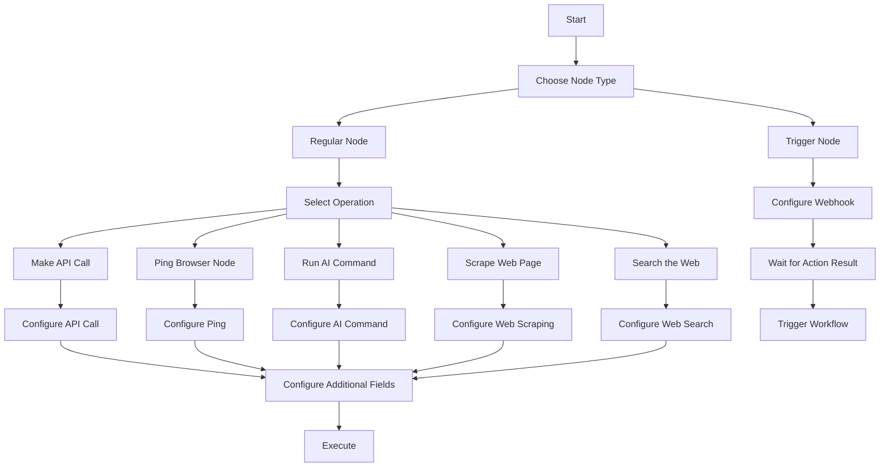

# Plan: Creating a Custom n8n Node for Harpa AI

## Overview

This plan outlines the steps to create a custom n8n node for Harpa AI that mirrors the structure of the existing Make.com integration, including both regular nodes for actions and a trigger node.

## Node Types to Implement

Based on the Make.com integration, we'll create:

### 1. Harpa AI (Regular Node)
Actions:
- Make an API Call
- Ping a Browser Node
- Run an AI Command
- Scrape a Web Page
- Search the Web

### 2. Harpa AI Trigger (Trigger Node)
- Watch Action Result

## Project Structure

```
n8n-nodes-starter/
├── credentials/
│   └── HarpaAiApi.credentials.ts
├── nodes/
│   ├── HarpaAi/
│   │   ├── harpa-ai.svg
│   │   ├── HarpaAi.node.json
│   │   └── HarpaAi.node.ts
│   └── HarpaAiTrigger/
│       ├── harpa-ai.svg (same icon)
│       ├── HarpaAiTrigger.node.json
│       └── HarpaAiTrigger.node.ts
├── package.json
├── tsconfig.json
└── README.md
```

## Implementation Plan

### 1. Project Setup

1. Clean up the starter repository by removing example nodes and credentials:
   - Remove `nodes/ExampleNode`
   - Remove `nodes/HTTPBin`
   - Remove `credentials/ExampleCredentials.credentials.ts`
   - Remove `credentials/HttpBinApi.credentials.ts`

2. Create the necessary directory structure:
   - Create `nodes/HarpaAi` directory
   - Create `nodes/HarpaAiTrigger` directory

3. Update package.json with project details:
   - Change name to "n8n-nodes-harpa-ai"
   - Update description, author, repository, etc.
   - Update the n8n section to point to the new nodes and credentials

### 2. Create Credentials

Create the `credentials/HarpaAiApi.credentials.ts` file to handle authentication with the Harpa AI API. This will require users to provide their API key, which will be sent in the Authorization header as a Bearer token.

### 3. Create Regular Node (HarpaAi.node.ts)

Implement the regular node with the following operations, using the exact parameters from the Make.com integration:

1. **Make an API Call**
   - URL (text, required)
   - Method (select: GET, POST, PUT, PATCH, DELETE, required)
   - Headers (array of key-value pairs)
   - Query String (array)

2. **Search the Web**
   - Query (text, required) - "Search query to perform."
   - Node (text, optional) - "Optional, tells which HARPA AI Chrome Extension node should perform the search action."
   - Timeout (number, default 300000) - "Optional, synchronous operation timeout in milliseconds."
   - Results Webhook (URL, optional) - "Instruct HARPA to send action results to specified URL."

3. **Run an AI Command**
   - Name (text, required) - "Name of the command to run."
   - Inputs (array, optional) - "Optional command inputs."
   - URL (URL, optional, default "https://harpa.ai/blank") - "Optional, starting web page URL."
   - Result Parameter (text, optional, default "message") - "Optional, name of a parameter to use as a result."
   - Node (text, optional) - "Optional, tells which HARPA AI Chrome Extension node should perform the command result."
   - Timeout (number, default 300000) - "Optional, synchronous operation timeout in milliseconds."
   - Results Webhook (URL, optional) - "Instruct HARPA to send action results to specified URL."

4. **Ping a Browser Node**
   - Node (text, optional, default "first") - "Optional, tells which HARPA AI Chrome Extension node should perform the ping action."
   - Timeout (number, default 300000) - "Optional, synchronous operation timeout in milliseconds."
   - Results Webhook (URL, optional) - "Instruct HARPA to send action results to specified URL."

5. **Scrape a Web Page**
   - URL (text, required) - "Web page URL to scrape for data."
   - Grab (array, optional) - "Optional, CSS / XPath / Text selector of the elements to grab."
   - Node (text, optional, default "first") - "Optional, tells which HARPA AI Chrome Extension node should perform the scrape action."
   - Timeout (number, default 300000) - "Optional, synchronous operation timeout in milliseconds."
   - Results Webhook (URL, optional) - "Instruct HARPA to send action results to specified URL."

### 4. Create Trigger Node (HarpaAiTrigger.node.ts)

Implement the trigger node that will:
- Watch for action results from Harpa browser nodes
- Trigger a workflow when a response is received
- Parameters: Webhook (text, required) - "For more information on how to create a webhook in HARPA AI Web Browser Agent, see the online Help."

### 5. Create Node Metadata

Create the metadata files for both nodes:
- `HarpaAi.node.json`
- `HarpaAiTrigger.node.json`

### 6. Add Icon

Download the Harpa AI logo and save it as an SVG file for both nodes.

## Detailed Implementation Steps

### 1. Clean Up and Setup

First, we'll remove the example files and create our directory structure:

```bash
# Remove example nodes and credentials
rm -rf nodes/ExampleNode
rm -rf nodes/HTTPBin
rm -rf credentials/ExampleCredentialsApi.credentials.ts
rm -rf credentials/HttpBinApi.credentials.ts

# Create necessary directories
mkdir -p nodes/HarpaAi
mkdir -p nodes/HarpaAiTrigger
```

### 2. Create Credentials File

Create `credentials/HarpaAiApi.credentials.ts`:

```typescript
import {
  IAuthenticateGeneric,
  ICredentialType,
  INodeProperties,
} from 'n8n-workflow';

export class HarpaAiApi implements ICredentialType {
  name = 'harpaAiApi';
  displayName = 'Harpa AI API';
  documentationUrl = 'https://harpa.ai/grid/grid-rest-api-reference';
  
  properties: INodeProperties[] = [
    {
      displayName: 'API Key',
      name: 'apiKey',
      type: 'string',
      default: '',
    },
  ];
  
  authenticate = {
    type: 'generic',
    properties: {
      headers: {
        Authorization: '=Bearer {{$credentials.apiKey}}',
      },
    },
  } as IAuthenticateGeneric;
}
```

### 3. Create Regular Node (HarpaAi.node.ts)

Create `nodes/HarpaAi/HarpaAi.node.ts` with a declarative structure:

```typescript
import { INodeType, INodeTypeDescription } from 'n8n-workflow';

export class HarpaAi implements INodeType {
  description: INodeTypeDescription = {
    displayName: 'Harpa AI',
    name: 'harpaAi',
    icon: 'file:harpa-ai.svg',
    group: ['transform'],
    version: 1,
    subtitle: '={{$parameter["operation"]}}',
    description: 'Interact with Harpa AI browser automation API',
    defaults: {
      name: 'Harpa AI',
    },
    inputs: ['main'],
    outputs: ['main'],
    credentials: [
      {
        name: 'harpaAiApi',
        required: true,
      },
    ],
    requestDefaults: {
      baseURL: 'https://api.harpa.ai/api/v1',
      headers: {
        Accept: 'application/json',
        'Content-Type': 'application/json',
      },
    },
    properties: [
      // Operations
      {
        displayName: 'Operation',
        name: 'operation',
        type: 'options',
        noDataExpression: true,
        options: [
          {
            name: 'Make API Call',
            value: 'apiCall',
            description: 'Perform an arbitrary authorized API call',
          },
          {
            name: 'Ping Browser Node',
            value: 'pingNode',
            description: 'Check if a browser node is online and ready',
          },
          {
            name: 'Run AI Command',
            value: 'runCommand',
            description: 'Run AI powered web automation or command',
          },
          {
            name: 'Scrape Web Page',
            value: 'scrapePage',
            description: 'Extract content from web pages',
          },
          {
            name: 'Search the Web',
            value: 'searchWeb',
            description: 'Search the web for a given query',
          },
        ],
        default: 'scrapePage',
      },
      
      // Make API Call Parameters
      {
        displayName: 'URL',
        name: 'url',
        type: 'string',
        default: '',
        required: true,
        displayOptions: {
          show: {
            operation: [
              'apiCall',
            ],
          },
        },
        routing: {
          request: {
            url: '={{$value}}',
          },
        },
      },
      {
        displayName: 'Method',
        name: 'method',
        type: 'options',
        options: [
          {
            name: 'GET',
            value: 'GET',
          },
          {
            name: 'POST',
            value: 'POST',
          },
          {
            name: 'PUT',
            value: 'PUT',
          },
          {
            name: 'PATCH',
            value: 'PATCH',
          },
          {
            name: 'DELETE',
            value: 'DELETE',
          },
        ],
        default: 'POST',
        required: true,
        displayOptions: {
          show: {
            operation: [
              'apiCall',
            ],
          },
        },
        routing: {
          request: {
            method: '={{$value}}',
          },
        },
      },
      {
        displayName: 'Headers',
        name: 'headers',
        placeholder: 'Add Header',
        type: 'fixedCollection',
        typeOptions: {
          multipleValues: true,
        },
        displayOptions: {
          show: {
            operation: [
              'apiCall',
            ],
          },
        },
        default: {},
        options: [
          {
            name: 'parameter',
            displayName: 'Header',
            values: [
              {
                displayName: 'Key',
                name: 'key',
                type: 'string',
                default: '',
              },
              {
                displayName: 'Value',
                name: 'value',
                type: 'string',
                default: '',
              },
            ],
          },
        ],
        routing: {
          request: {
            headers: '={{$value.parameter.reduce((acc, cur) => { acc[cur.key] = cur.value; return acc; }, {})}}',
          },
        },
      },
      {
        displayName: 'Query Parameters',
        name: 'queryParameters',
        placeholder: 'Add Parameter',
        type: 'fixedCollection',
        typeOptions: {
          multipleValues: true,
        },
        displayOptions: {
          show: {
            operation: [
              'apiCall',
            ],
          },
        },
        default: {},
        options: [
          {
            name: 'parameter',
            displayName: 'Parameter',
            values: [
              {
                displayName: 'Key',
                name: 'key',
                type: 'string',
                default: '',
              },
              {
                displayName: 'Value',
                name: 'value',
                type: 'string',
                default: '',
              },
            ],
          },
        ],
        routing: {
          request: {
            qs: '={{$value.parameter.reduce((acc, cur) => { acc[cur.key] = cur.value; return acc; }, {})}}',
          },
        },
      },
      
      // Ping Browser Node Parameters
      {
        displayName: 'Node',
        name: 'pingNodeId',
        type: 'string',
        default: 'first',
        displayOptions: {
          show: {
            operation: [
              'pingNode',
            ],
          },
        },
        description: 'Optional, tells which HARPA AI Chrome Extension node should perform the ping action. If no node specified, HARPA will perform action over the first available node. A space separated list of nodes can be specified, for example \'x91k t3od ux5e\'. You can specify \'*\' to run action over every node. You can specify a Number (e.g. 3) to run action over 3 first nodes.',
        routing: {
          request: {
            method: 'POST',
            url: '/grid',
            body: {
              action: 'ping',
              node: '={{$value}}',
            },
          },
        },
      },
      
      // Run AI Command Parameters
      {
        displayName: 'Command Name',
        name: 'commandName',
        type: 'string',
        default: '',
        required: true,
        displayOptions: {
          show: {
            operation: [
              'runCommand',
            ],
          },
        },
        description: 'Name of the command to run. Over 100+ AI-powered commands can be seen in the HARPA Chrome Extension upon typing slash /. Custom user-created commands supported.',
        routing: {
          send: {
            type: 'body',
            property: 'name',
          },
        },
      },
      {
        displayName: 'Command Inputs',
        name: 'commandInputs',
        type: 'string',
        typeOptions: {
          multipleValues: true,
        },
        default: [],
        displayOptions: {
          show: {
            operation: [
              'runCommand',
            ],
          },
        },
        description: 'Optional command inputs. Inputs are auto-applied to the ASK steps.',
        routing: {
          send: {
            type: 'body',
            property: 'inputs',
          },
        },
      },
      {
        displayName: 'URL',
        name: 'commandUrl',
        type: 'string',
        default: 'https://harpa.ai/blank',
        displayOptions: {
          show: {
            operation: [
              'runCommand',
            ],
          },
        },
        description: 'Optional, starting web page URL. Set to https://harpa.ai/blank if not specified.',
        routing: {
          send: {
            type: 'body',
            property: 'url',
          },
        },
      },
      {
        displayName: 'Result Parameter',
        name: 'resultParam',
        type: 'string',
        default: 'message',
        displayOptions: {
          show: {
            operation: [
              'runCommand',
            ],
          },
        },
        description: 'Optional, name of a parameter to use as a result. Last AI chat message by default. Supports dot notation, e.g. g.data.email, see https://harpa.ai/chatml/overview for more information.',
        routing: {
          send: {
            type: 'body',
            property: 'resultParam',
          },
        },
      },
      {
        displayName: 'Request Body',
        name: 'commandRequestBody',
        type: 'hidden',
        default: '={"action":"command"}',
        displayOptions: {
          show: {
            operation: [
              'runCommand',
            ],
          },
        },
        routing: {
          request: {
            method: 'POST',
            url: '/grid',
            body: {
              action: 'command',
            },
          },
        },
      },
      
      // Scrape Web Page Parameters
      {
        displayName: 'URL',
        name: 'scrapeUrl',
        type: 'string',
        default: '',
        required: true,
        displayOptions: {
          show: {
            operation: [
              'scrapePage',
            ],
          },
        },
        description: 'Web page URL to scrape for data.',
        routing: {
          send: {
            type: 'body',
            property: 'url',
          },
        },
      },
      {
        displayName: 'Grab Selectors',
        name: 'grabSelectors',
        placeholder: 'Add Selector',
        type: 'fixedCollection',
        typeOptions: {
          multipleValues: true,
        },
        default: {},
        displayOptions: {
          show: {
            operation: [
              'scrapePage',
            ],
          },
        },
        description: 'Optional, CSS / XPath / Text selector of the elements to grab. Omit this if you only need a markdown content of the web page.',
        options: [
          {
            name: 'selectorValues',
            displayName: 'Selector',
            values: [
              {
                displayName: 'Selector',
                name: 'selector',
                type: 'string',
                default: '',
                description: 'CSS, XPath, or Text content selector',
              },
              {
                displayName: 'Selector Type',
                name: 'selectorType',
                type: 'options',
                options: [
                  {
                    name: 'Auto',
                    value: 'auto',
                  },
                  {
                    name: 'CSS',
                    value: 'css',
                  },
                  {
                    name: 'XPath',
                    value: 'xpath',
                  },
                  {
                    name: 'Text',
                    value: 'text',
                  },
                ],
                default: 'auto',
              },
              {
                displayName: 'Position',
                name: 'at',
                type: 'options',
                options: [
                  {
                    name: 'All',
                    value: 'all',
                  },
                  {
                    name: 'First',
                    value: 'first',
                  },
                  {
                    name: 'Last',
                    value: 'last',
                  },
                ],
                default: 'first',
              },
              {
                displayName: 'Data to Extract',
                name: 'take',
                type: 'options',
                options: [
                  {
                    name: 'Inner Text',
                    value: 'innerText',
                  },
                  {
                    name: 'Text Content',
                    value: 'textContent',
                  },
                  {
                    name: 'HTML',
                    value: 'innerHTML',
                  },
                  {
                    name: 'Outer HTML',
                    value: 'outerHTML',
                  },
                  {
                    name: 'Href',
                    value: 'href',
                  },
                ],
                default: 'innerText',
              },
              {
                displayName: 'Label',
                name: 'label',
                type: 'string',
                default: 'data',
                description: 'Custom label for the extracted data',
              },
            ],
          },
        ],
        routing: {
          send: {
            preSend: [
              async function (this, requestOptions) {
                const selectors = this.getNodeParameter('grabSelectors', 0) as { selectorValues: Array<{ selector: string, selectorType: string, at: string, take: string, label: string }> };
                
                if (selectors?.selectorValues) {
                  const grab = selectors.selectorValues.map(s => ({
                    selector: s.selector,
                    selectorType: s.selectorType,
                    at: s.at,
                    take: s.take,
                    label: s.label,
                  }));
                  
                  requestOptions.body.grab = grab;
                }
                
                return requestOptions;
              },
            ],
          },
        },
      },
      {
        displayName: 'Request Body',
        name: 'scrapeRequestBody',
        type: 'hidden',
        default: '={"action":"scrape"}',
        displayOptions: {
          show: {
            operation: [
              'scrapePage',
            ],
          },
        },
        routing: {
          request: {
            method: 'POST',
            url: '/grid',
            body: {
              action: 'scrape',
            },
          },
        },
      },
      
      // Search the Web Parameters
      {
        displayName: 'Query',
        name: 'searchQuery',
        type: 'string',
        default: '',
        required: true,
        displayOptions: {
          show: {
            operation: [
              'searchWeb',
            ],
          },
        },
        description: 'Search query to perform.',
        routing: {
          send: {
            type: 'body',
            property: 'query',
          },
        },
      },
      {
        displayName: 'Request Body',
        name: 'searchRequestBody',
        type: 'hidden',
        default: '={"action":"serp"}',
        displayOptions: {
          show: {
            operation: [
              'searchWeb',
            ],
          },
        },
        routing: {
          request: {
            method: 'POST',
            url: '/grid',
            body: {
              action: 'serp',
            },
          },
        },
      },
      
      // Common Additional Fields
      {
        displayName: 'Additional Fields',
        name: 'additionalFields',
        type: 'collection',
        placeholder: 'Add Field',
        default: {},
        displayOptions: {
          show: {
            operation: [
              'runCommand',
              'scrapePage',
              'searchWeb',
              'pingNode',
            ],
          },
        },
        options: [
          {
            displayName: 'Node',
            name: 'nodeId',
            type: 'string',
            default: '',
            description: 'Optional, tells which HARPA AI Chrome Extension node should perform the action. If no node specified, HARPA will perform action over the first available node. A space separated list of nodes can be specified, for example \'x91k t3od ux5e\'. You can specify \'*\' to run action over every node. You can specify a Number (e.g. 3) to run action over 3 first nodes.',
            routing: {
              send: {
                type: 'body',
                property: 'node',
              },
            },
          },
          {
            displayName: 'Timeout',
            name: 'timeout',
            type: 'number',
            default: 300000,
            description: 'Optional, synchronous operation timeout in milliseconds. If action does not resolve in the given time, it is aborted. By default 300000, or 5 minutes.',
            routing: {
              send: {
                type: 'body',
                property: 'timeout',
              },
            },
          },
          {
            displayName: 'Results Webhook',
            name: 'resultsWebhook',
            type: 'string',
            default: '',
            description: 'Instruct HARPA to send action results to specified URL. If this field is set, HARPA will try to reach your node (browser) for 30 days until it is online. Results will be sent in a POST request to the URL provided, which can be a webhook, API endpoint, Make.com scenario trigger, etc.',
            routing: {
              send: {
                type: 'body',
                property: 'resultsWebhook',
              },
            },
          },
        ],
      },
    ],
  };

  async execute() {
    // This is a declarative node, so no execute method is needed
    return [];
  }
}
```

### 4. Create Trigger Node (HarpaAiTrigger.node.ts)

Create `nodes/HarpaAiTrigger/HarpaAiTrigger.node.ts`:

```typescript
import {
  INodeType,
  INodeTypeDescription,
  IWebhookFunctions,
  IWebhookResponseData,
} from 'n8n-workflow';

export class HarpaAiTrigger implements INodeType {
  description: INodeTypeDescription = {
    displayName: 'Harpa AI Trigger',
    name: 'harpaAiTrigger',
    icon: 'file:harpa-ai.svg',
    group: ['trigger'],
    version: 1,
    description: 'Triggers when Harpa Chrome Extension node has responded to a run action request',
    defaults: {
      name: 'Harpa AI Trigger',
    },
    inputs: [],
    outputs: ['main'],
    credentials: [
      {
        name: 'harpaAiApi',
        required: true,
      },
    ],
    webhooks: [
      {
        name: 'default',
        httpMethod: 'POST',
        responseMode: 'onReceived',
        path: 'webhook',
      },
    ],
    properties: [
      {
        displayName: 'Webhook URL',
        name: 'webhookUrl',
        type: 'string',
        default: '={{ $getNodeWebhookUrl }}',
        description: 'For more information on how to create a webhook in HARPA AI Web Browser Agent, see the online Help.',
        readonly: true,
      },
    ],
  };

  async webhook(this: IWebhookFunctions): Promise<IWebhookResponseData> {
    const req = this.getRequestObject();
    const body = req.body;

    // Return the webhook response data
    return {
      workflowData: [
        this.helpers.returnJsonArray(body),
      ],
    };
  }
}
```

### 5. Create Node Metadata Files

Create `nodes/HarpaAi/HarpaAi.node.json`:

```json
{
  "node": "n8n-nodes-base.harpaAi",
  "nodeVersion": "1.0",
  "codexVersion": "1.0",
  "categories": [
    "Utility",
    "Data & Storage",
    "AI"
  ],
  "resources": {
    "credentialDocumentation": [
      {
        "url": "https://harpa.ai/grid/grid-rest-api-reference"
      }
    ],
    "primaryDocumentation": [
      {
        "url": "https://harpa.ai/grid/web-automation"
      }
    ]
  }
}
```

Create `nodes/HarpaAiTrigger/HarpaAiTrigger.node.json`:

```json
{
  "node": "n8n-nodes-base.harpaAiTrigger",
  "nodeVersion": "1.0",
  "codexVersion": "1.0",
  "categories": [
    "Utility",
    "Data & Storage",
    "AI"
  ],
  "resources": {
    "credentialDocumentation": [
      {
        "url": "https://harpa.ai/grid/grid-rest-api-reference"
      }
    ],
    "primaryDocumentation": [
      {
        "url": "https://harpa.ai/grid/web-automation"
      }
    ]
  }
}
```

### 6. Update package.json

Update `package.json`:

```json
{
  "name": "n8n-nodes-harpa-ai",
  "version": "0.1.0",
  "description": "n8n node to interact with Harpa AI's browser automation API",
  "keywords": [
    "n8n-community-node-package",
    "harpa-ai",
    "browser-automation",
    "web-scraping"
  ],
  "license": "MIT",
  "homepage": "https://harpa.ai",
  "author": {
    "name": "Your Name",
    "email": "your.email@example.com"
  },
  "repository": {
    "type": "git",
    "url": "git+https://github.com/yourusername/n8n-nodes-harpa-ai.git"
  },
  "main": "index.js",
  "scripts": {
    "build": "tsc && gulp build:icons",
    "dev": "tsc --watch",
    "format": "prettier nodes credentials --write",
    "lint": "eslint nodes credentials package.json",
    "lintfix": "eslint nodes credentials package.json --fix",
    "prepublishOnly": "npm run build && npm run lint -c .eslintrc.prepublish.js nodes credentials package.json"
  },
  "files": [
    "dist"
  ],
  "n8n": {
    "n8nNodesApiVersion": 1,
    "credentials": [
      "dist/credentials/HarpaAiApi.credentials.js"
    ],
    "nodes": [
      "dist/nodes/HarpaAi/HarpaAi.node.js",
      "dist/nodes/HarpaAiTrigger/HarpaAiTrigger.node.js"
    ]
  }
}
```

## Workflow Diagram



## Implementation Strategy

1. **Phase 1: Setup and Basic Structure**
   - Clean up the starter repository
   - Create the credentials file
   - Create the basic structure for both nodes

2. **Phase 2: Implement Regular Node**
   - Implement Make API Call operation
   - Implement Ping Browser Node operation
   - Implement Run AI Command operation
   - Implement Scrape Web Page operation
   - Implement Search the Web operation
   - Test with the provided API key

3. **Phase 3: Implement Trigger Node**
   - Implement webhook handling
   - Test with the provided API key

4. **Phase 4: Finalize and Test**
   - Add comprehensive error handling
   - Ensure proper parameter validation
   - Test all operations with various inputs
   - Document usage examples